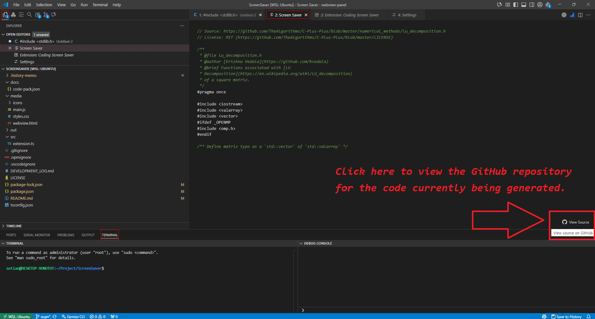

# Coding Screen Saver 👨‍💻

> **"Even if you sleep or leave your seat, this screensaver keeps coding. Your boss will think you're working all night."**

*(Note: Please add a `demo.gif` to the `media` folder to see the preview here!)*

## 🚀 Introduction

**Coding Screen Saver** is an immersive extension for VS Code that simulates live coding. It fetches real code snippets from open-source repositories (GitHub) and types them out on your screen when you are idle.

It's not just a screensaver; it's a **productivity camouflage tool**.

## ✨ Features

- **🕵️‍♂️ Boss-Proof Mode**: Simulates realistic typing speeds to make it look like you are hard at work.
- **📚 Real Code**: Fetches snippets from popular repos like *TheAlgorithms*, *30 Seconds of Code*, and more.
- **⚡ Instant Activation**: Detects idleness (keyboard/mouse) and kicks in automatically.
- **🛡️ Rate-Limit Safe**: Smartly handles GitHub API limits by falling back to a built-in offline code pack.
- **🎨 Customizable**: Adjust typing speed, idle timeout, and specific repositories to fetch from.

## ⚙️ Configuration

You can customize the behavior in `settings.json`:

| Setting | Description | Default |
| :--- | :--- | :--- |
| `screenSaver.idleTimeSeconds` | Seconds of inactivity before activation | `300` (5 min) |
| `screenSaver.typingSpeed` | Typing speed (ms per char) | `40` |
| `screenSaver.repositories.enabled` | Choose which repos to fetch code from | All enabled |

## 🤝 Development Journey

The entire development process for this extension was done in collaboration with **Google Gemini**. You can view the complete conversation and history in [DEVELOPMENT_LOG.md](./DEVELOPMENT_LOG.md).

## 📝 License
절 대 세 찬
MIT
