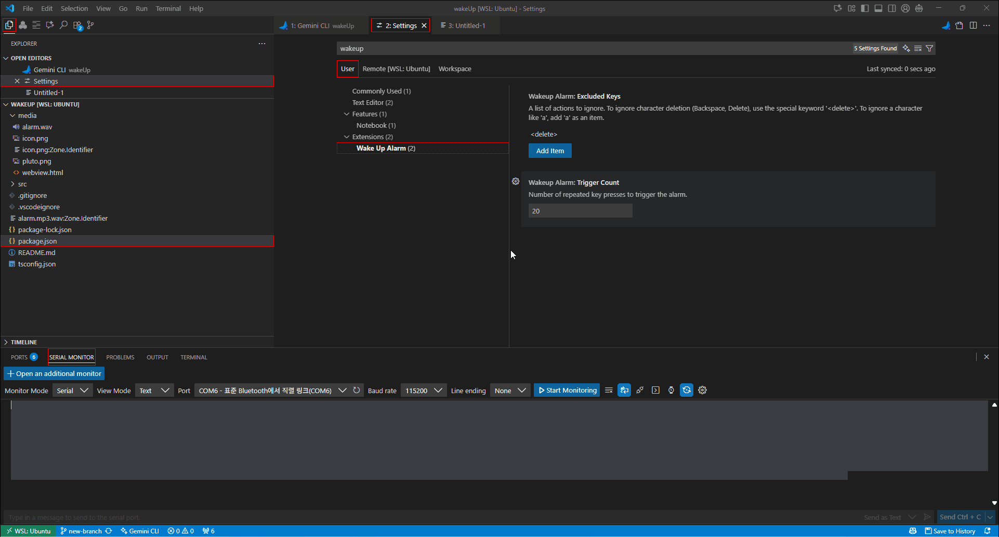

# Wake Up Alarm Extension

A simple VS Code extension to alert you when you might be falling asleep at the keyboard.

## Features

- Monitors key presses to detect long strings of the same character being repeated.
- If the same key is pressed 20 times in a row, a warning message appears and an alarm sound plays.
- The alarm sound stops as soon as you resume normal typing (i.e., press a different key).

## How to Use

1.  Install the extension.
2.  Make sure you have a sound file named `alarm.mp3` or `alarm.wav` inside a `media` folder in your extension's installation directory.
3.  The extension will automatically monitor your typing.

## Important Notes

- If your computer is on mute or the volume is too low, you may not hear the alarm sound.

## Known Issues

### IME Language Support (Korean, Japanese, Chinese, etc.)

Due to the way Input Method Editors (IMEs) compose characters, the extension may count repeated characters faster than intended. For example, typing 10 identical Korean characters may be counted as 20 repeats by the extension, triggering the alarm prematurely.

This is a known limitation, and we are looking into more robust ways to handle character input from various language sources.

## Contributing

This project was created by [setian](https://github.com/setian).
